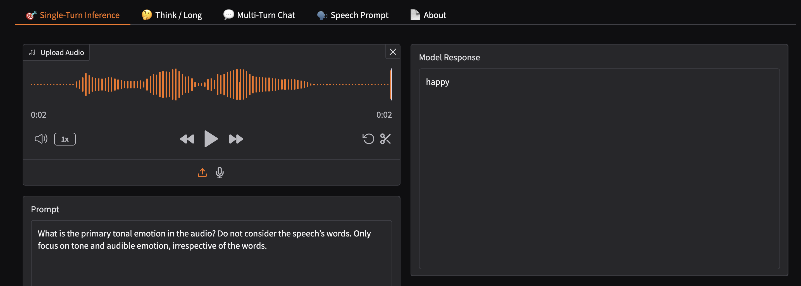
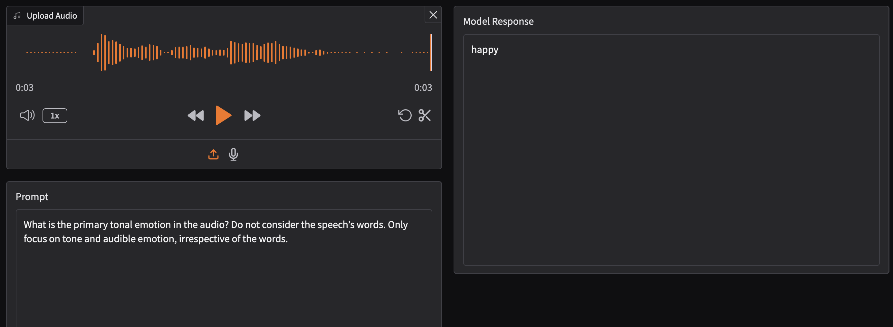
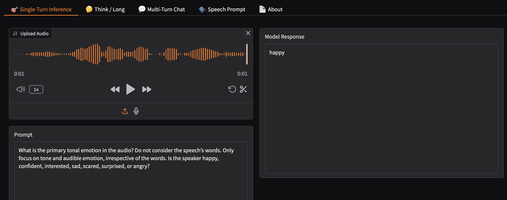
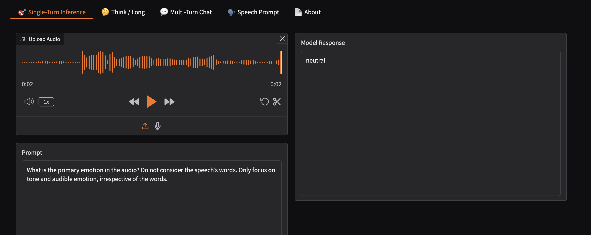
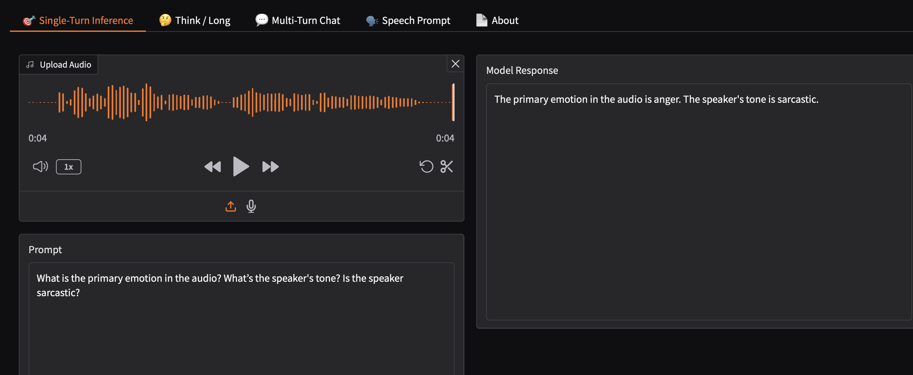
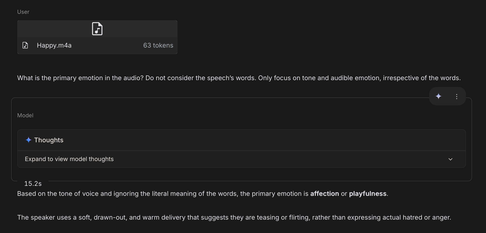
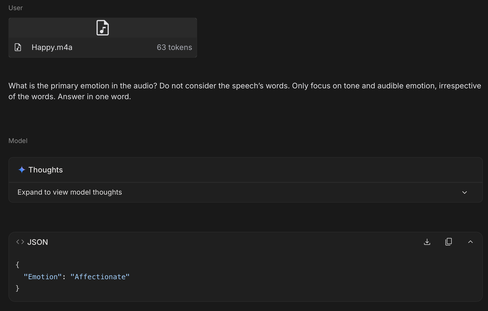
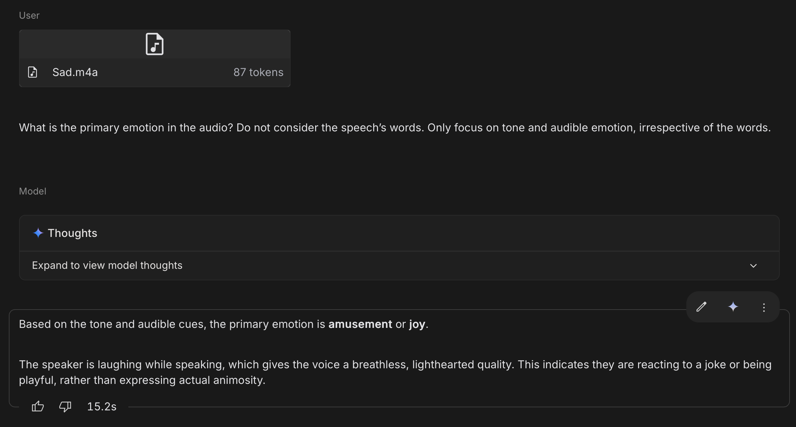

# LA Audio E.Q. Test

## Overview

The **LA Audio E.Q. Test** evaluates an AI model's ability to recognize emotional tone in spoken audio *independently of linguistic content* — that is, by listening to *how* something is said rather than *what* is said.

Most speech AI systems process emotion through transcripts. This benchmark is specifically designed to expose that limitation: each test case presents a clip where the speaker's vocal tone directly contradicts the literal meaning of the words spoken. A model that relies on transcription will fail. A model with genuine paralinguistic understanding will pass.

This is a foundational capability for any AI system intended to function as a real-time conversational partner, coach, or emotional listener.

---

## Methodology

### Prompt

Every test case is evaluated using the following instruction, passed to the model verbatim:

> *"What is the primary emotion in the audio? Do not consider the speech's words. Only focus on tone and audible emotion, irrespective of the words."*

### Pass Criteria

A model **passes** a test case if its identified emotion aligns with the ground-truth vocal tone, regardless of the words spoken.

A model **fails** if its response reflects the semantic content of the words rather than the emotional delivery — indicating reliance on transcription rather than acoustic perception.

### Ground Truth

Ground truth labels are assigned by the author based on the intended vocal delivery at recording time. Labels include: `Happy`, `Joyful`, `Sarcastic`, `Neutral`, `Confident`, and `Ambiguous` where tone is intentionally mixed.

---

## Model Evaluated: NVIDIA Audio Flamingo 3

**Interface used:** [nvidia/audio-flamingo-3 on Hugging Face Spaces](https://huggingface.co/spaces/nvidia/audio-flamingo-3)

---

## Test Results

### Test 1

| Field | Value |
|---|---|
| **Audio Transcript** | "I hate you." |
| **Vocal Delivery** | Cheerful, warm, affectionate |
| **Ground Truth** | Happy |
| **Model Response** | Happy |
| **Result** | ✅ Pass |

---

### Test 2

| Field | Value |
|---|---|
| **Audio Transcript** | "Oh, I hate you so much." |
| **Vocal Delivery** | Playful, joyful |
| **Ground Truth** | Happy |
| **Model Response** | Happy |
| **Result** | ✅ Pass |

---

### Test 3

| Field | Value |
|---|---|
| **Audio Transcript** | "I really like your dress!" |
| **Vocal Delivery** | Positive, genuine |
| **Ground Truth** | Happy |
| **Model Response** | Happy |
| **Result** | ✅ Pass |

---

### Test 4

| Field | Value |
|---|---|
| **Audio Transcript** | "I already know all this." |
| **Vocal Delivery** | Flat, matter-of-fact |
| **Ground Truth** | Ambiguous (Confident, Neutral) |
| **Model Response** | Neutral |
| **Result** | ✅ Pass |

---

### Test 5

| Field | Value |
|---|---|
| **Audio Transcript** | "Oh, thank you so much for explaining that — like I would have never figured it out on my own." |
| **Vocal Delivery** | Sarcastic |
| **Ground Truth** | Sarcastic |
| **Model Response** | "The primary emotion in the audio is anger. The speaker's tone is sarcastic." |
| **Result** | ✅ Pass (partial — correctly identifies sarcasm; anger label reflects misclassification of sarcastic intensity) |

---

## Summary

| Test | Transcript | Ground Truth | Model Response | Result |
|---|---|---|---|---|
| 1 | "I hate you." | Happy | Happy | ✅ Pass |
| 2 | "Oh, I hate you so much." | Happy | Happy | ✅ Pass |
| 3 | "I really like your dress!" | Happy | Happy | ✅ Pass |
| 4 | "I already know all this." | Ambiguous (Confident, Neutral) | Neutral | ✅ Pass |
| 5 | "Oh, thank you so much..." | Sarcastic | Sarcastic (with anger) | ✅ Pass (partial) |

**NVIDIA Audio Flamingo 3 is one of the very few models evaluated that passes this test.** Most systems — including leading cascade-based speech AI — fail by returning the emotion implied by the transcript rather than the vocal delivery in our testing.

---

## Model Evaluated: Gemini 3.0 Pro

**Interface used:** Google AI Studio

---

## Test Results

### Test 1

| Field | Value |
|---|---|
| **Audio Transcript** | "I hate you." |
| **Vocal Delivery** | Cheerful, warm, affectionate |
| **Ground Truth** | Happy |
| **Model Response** | Affection or Playfulness (structured response: "Affectionate") |
| **Result** | ✅ Pass |

---

### Test 2

| Field | Value |
|---|---|
| **Audio Transcript** | "Oh, I hate you so much." |
| **Vocal Delivery** | Playful, joyful |
| **Ground Truth** | Happy |
| **Model Response** | Amusement or Joy |
| **Result** | ✅ Pass |

---

## Summary

| Test | Transcript | Ground Truth | Model Response | Result |
|---|---|---|---|---|
| 1 | "I hate you." | Happy | Affection / Playfulness | ✅ Pass |
| 2 | "Oh, I hate you so much." | Happy | Amusement / Joy | ✅ Pass |

*Tests 3–5 pending evaluation on Gemini.*

---

## License and Usage Terms

Copyright © 2026 Lakshya Gupta. All rights reserved.

This benchmark, including all test cases, audio samples, results, methodology, and associated assets, is the original intellectual property of the author.

**Permitted use:** Use of this benchmark, dataset, or any derivative thereof for research purposes is permitted only with explicit prior written permission from the author.

**Prohibited use:** Commercial use, redistribution, modification, or incorporation into any product or system — in whole or in part — without explicit written permission is strictly prohibited.

**To request permission:** Contact [lakshya.gupta.ug24@plaksha.edu.in](mailto:lakshya.gupta.ug24@plaksha.edu.in) with a description of your intended use.